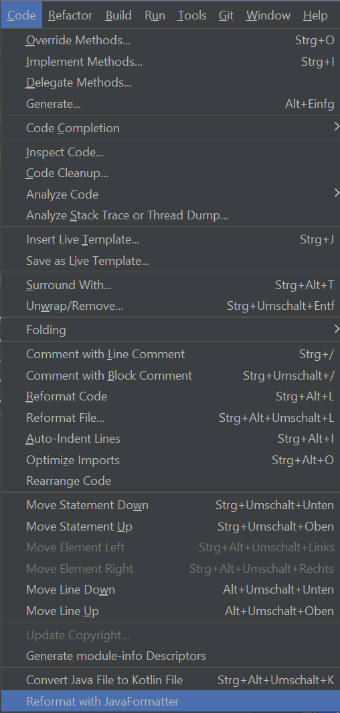
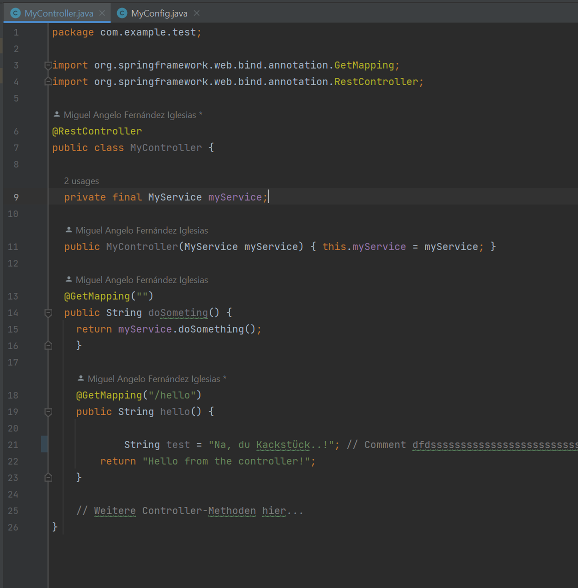
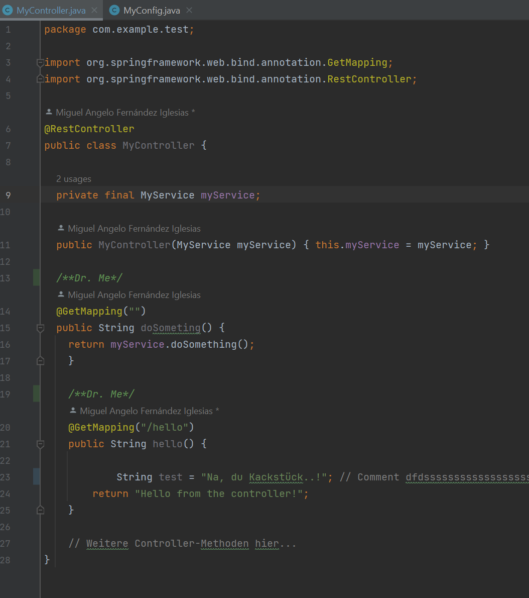
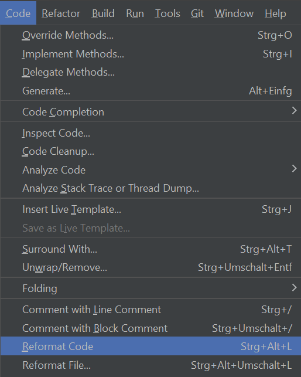
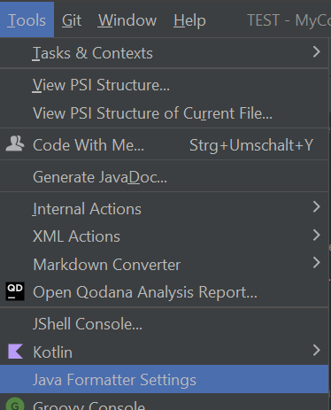

# JavaFormatter (PROTOTYPE ONLY)

This plugin utilizes the JavaParser since it has the feature of "Lexical-Preseving Printing".

## Usage
To start formatting you need to select Code -> Reformat with JavaFormatter:

Since this is a Prototype Formatting Rules have to be applied in code. Add them to the "FormattingRules" class and call them in "applyFormattingRules". If there are no rules the code remains untouched.

Here is an example of the "addCommentsToPublicMethods" Rule.

before:

after:

### NOT WORKING (IntelliJ Default Formatter):
To start formatting your code you need to press Ctrl+Alt+L (Windows/Linux) or Cmd+Option+L (Mac), otherwise nothing happens. 

For an understanding how it works, see `public class CustomFormattingModelBuilder implements FormattingModelBuilder`.

You may use other API Classes to perform other actions (e.g. automatically).

## Extensibility

The formatting aka. Lexical-Preseving Printing ist done in the class JavaFormatter.java. Feel free to adjust.

## GUI
A menu can be found under Tools -> Java Formatter Settings (see JavaFormatterSettingsAction class).

The menus under Settings -> Tools -> JavaFormatter does not work for some reason.

## ToDo
A Menu and Config File Import in Clang-Format or Jalopy style may be added via IntelliJs API (see the Clang-Format, GoogleFormat, or even Jalopy Plugin for an example).

### Jalopy Comparison
Um dieselbe Funktion von Jalopy zu erreichen, muss eine Aktion auf "on Save" registriert werden:
